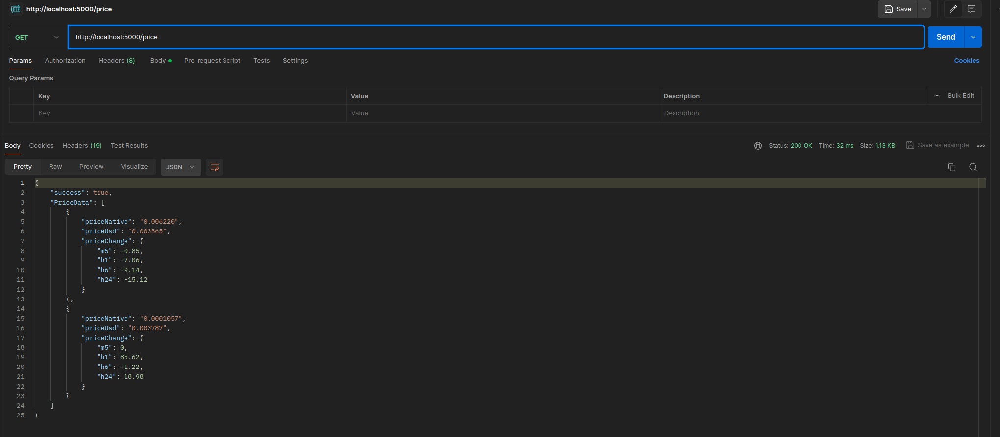
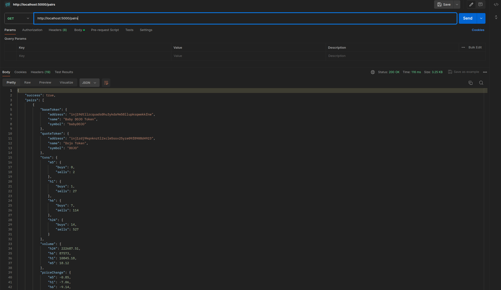

Here is a step-by-step user guide for accessing the endpoints to fetch volume, price, and all pairs data f

### Prerequisites:

- Ensure you have Node.js installed on your machine.
- Make sure you have your project set up with the necessary dependencies and configurations.

### Steps:

1. **Open the Project in VSCode or Any Editor**:

   - Open your project directory in your preferred code editor.

2. **Navigate to Server Directory**:

   - Using the terminal integrated in your editor or a separate terminal window, navigate to the server directory of your project.

3. **Start the Server**:

   - Type `npm start` in the terminal and press Enter to start your server.

4. **Open Thunder Client or Postman**:

   - Launch Thunder Client or Postman, whichever you prefer to use for API testing.

5. **Testing Endpoints**:

   - For fetching volume data:

     - Select the HTTP method GET.
     - Enter the following URL: `http://localhost:5000/volume`.
     - Click on the "Send" button to make the request.

   - For fetching price data:

     - Select the HTTP method GET.
     - Enter the following URL: `http://localhost:5000/price`.
     - Click on the "Send" button to make the request.

   - For fetching all pairs data:
     - Select the HTTP method GET.
     - Enter the following URL: `http://localhost:5000/pairs`.
     - Click on the "Send" button to make the request.

6. **Viewing Results**:

   - Once the request is sent, you will receive a response from the server.
   - The response will contain the requested data (volume, price, or pairs) in the specified format (JSON).

7. **Reviewing Error Responses**:
   - If there are any errors in the request or server-side issues, you will receive an error response.
   - The error response will contain appropriate error messages and status codes to help diagnose the issue.

### Notes:

- Ensure that your server is running while making requests.
- Verify that the URLs match the routes defined in your server code.
- Test different endpoints to ensure that all functionalities are working as expected.

### Sample Output

- Volume

- Price

- All Pairs data

